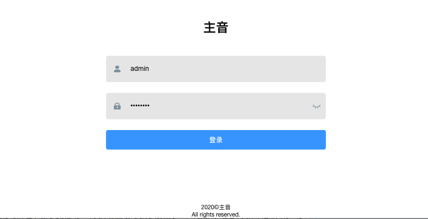

# 主音社区-管理员后台

## Description

### 一个基于[Vue.js](https://github.com/vuejs/vue)+[Element-ui](https://github.com/ElemeFE/element)的开发的主音后台管理页面

## Preview

  

  

  

  

## Usage
1. 更改```src/config```目录下配置文件，配置管理后端接口地址
2. 安装依赖
    > ```bash
    > npm install
    > ```

3. 以开发模式编译运行
    > ```bash
    > npm run dev
    > ```

4. 编译并压缩产生正式代码
    > ```bash
    > npm run build
    > ```

5. 代码格式化
    > ```bash
    > npm run lint
    > ```

## TODO List:
- [x] 管理员管理
- [x] 用户管理
- [x] 广场动态管理
- [x] 广场评论管理
- [ ] 举报管理
- [ ] 广告管理
- [ ] 系统设置